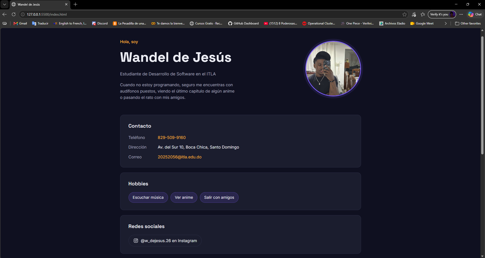
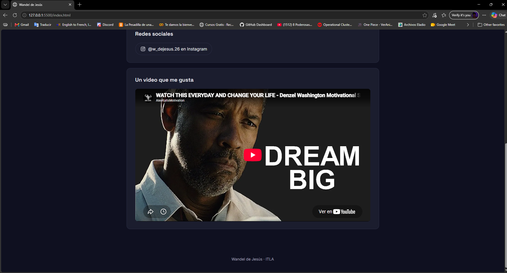

# Página Web Personal

Tarea 1 de Programación Web (ITLA) — una página web personal hecha con HTML5 y CSS3, con foto, datos de contacto, hobbies, redes sociales y un video de YouTube.

## Estructura del proyecto

```
tarea1-pweb/
├── index.html
├── css/
│   └── styles.css
└── assets/
    └── foto-wandel.jpeg
        evidencia1.jpeg
        evidencia2.jpeg
```

## Cómo verla

Abre `index.html` directamente en el navegador (Chrome), o clona el repositorio y ábrelo con Live Server desde VS Code.

## Evidencias

Capturas de pantalla de la página funcionando:




## Autor

Wandel De Jesus — Estudiante de Desarrollo de Software, ITLA
